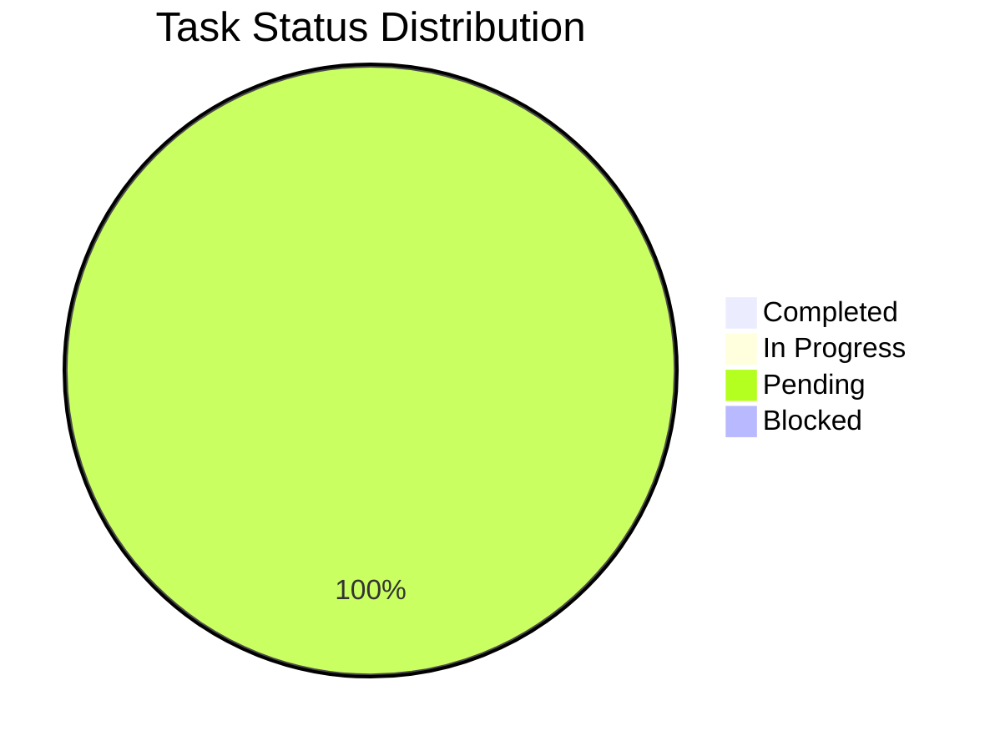

# Setup Template Centralization

**Spec ID:** `setup-template-centralization-2025-11-10-001`  
**Status:** pending  
**Progress:** 0/46 tasks (0%)  

Centralize all setup-related configuration templates into a unified directory structure with a standard helper module for accessing them via importlib.resources

{
  "response": "## Executive Summary: Setup Template Centralization\n\n### Objectives\n\nThis project aims to centralize all setup-related configuration templates into a single, unified directory. The primary goal is to improve maintainability and consistency by creating a standard helper module for accessing these templates. Key deliverables include the new template directory, a Python helper module (`setup_templates.py`), and refactored setup scripts that utilize this new system.\n\n### Scope\n\nThe scope of this specification includes identifying all existing setup templates, relocating them to `src/claude_skills/claude_skills/common/templates/setup/`, and implementing a helper module for access via `importlib.resources`. All setup scripts that currently use these templates will be refactored to adopt the new centralized method. This effort is confined to setup configuration files and does not include refactoring other application-level templates.\n\n### Key Phases\n\n*   **Phase 1: Template Infrastructure Setup (4.25 hours)**\n    *   Goal: Create the centralized directory structure and the `setup_templates.py` helper module.\n    *   Deliverable: A packaged Python module containing all necessary setup templates.\n*   **Phase 2: Setup Script Refactoring (6.5 hours)**\n    *   Goal: Update all existing setup scripts to import and use the new template helper.\n    *   Deliverable: Refactored code with all hardcoded paths and inline configurations removed.\n*   **Phase 3: Tests, Packaging & Documentation (2.5 hours)**\n    *   Goal: Add comprehensive unit and integration tests for the new module and update documentation.\n    *   Deliverable: A fully tested and documented implementation.\n*   **Phase 4: Cleanup (0.25 hours)**\n    *   Goal: Remove all old, now-redundant template files from their original locations.\n    *   Deliverable: A clean codebase with no duplicate or obsolete template files.\n\n### Critical Path\n\nThe project's phases are strictly sequential and form the critical path. **Phase 1 (Infrastructure)** must be completed before **Phase 2 (Refactoring)** can begin. Similarly, Phase 2 blocks **Phase 3 (Testing)**, which in turn blocks **Phase 4 (Cleanup)**. Any delay in an earlier phase will directly impact the start date of all subsequent phases and the final delivery.\n\n### Estimated Effort\n\nThe total estimated effort for this project is **13.5 hours**. Currently, **0%** of the work is complete, with all 13.5 hours remaining. Assuming a standard workload, the project can be completed within a few development days. No specialized resources are required beyond a Python developer familiar with the existing codebase.\n\n### Major Risks\n\n*   **Sequential Blockers:** The primary risk is the linear dependency between phases; a delay in any phase will stall the entire project.\n*   **Refactoring Errors:** Modifying multiple setup scripts in Phase 2 could introduce subtle bugs if the new template helper is not implemented or used correctly.\n*   **Incomplete Cleanup:** There is a minor risk that not all old template files are identified and removed in Phase 4, leading to future confusion.\n*   **Testing Gaps:** Unit and integration tests must be thorough to catch regressions in the setup process across different parts of the application.\n\n### Next Steps\n\n*   **Begin Phase 1:** Start immediately with the \"Template Infrastructure Setup\".\n*   **Prioritize Helper Module:** Focus on creating a robust `setup_templates.py` module, as it is the core dependency for all subsequent refactoring work.\n*   **Execute Verification Tasks:** Ensure the automated verification checks for Phase 1 pass before proceeding to Phase 2 to mitigate downstream issues.",
  "stats": {
    "models": {
      "gemini-2.5-pro": {
        "api": {
          "totalRequests": 1,
          "totalErrors": 0,
          "totalLatencyMs": 15532
        },
        "tokens": {
          "prompt": 22467,
          "candidates": 771,
          "total": 24098,
          "cached": 0,
          "thoughts": 860,
          "tool": 0
        }
      }
    },
    "tools": {
      "totalCalls": 0,
      "totalSuccess": 0,
      "totalFail": 0,
      "totalDurationMs": 0,
      "totalDecisions": {
        "accept": 0,
        "reject": 0,
        "modify": 0,
        "auto_accept": 0
      },
      "byName": {}
    },
    "files": {
      "totalLinesAdded": 0,
      "totalLinesRemoved": 0
    }
  }
}

### Quick Stats

- **Progress**: 0/46 tasks (0.0%)
- **Phases**: 4 phases
- **Estimated Effort**: 13.5 hours total
  - Completed: 0.0h
  - In Progress: 0.0h
  - Remaining: 13.5h
- **Status Breakdown**:
  - ✅ Completed: 0
  - 🔄 In Progress: 0
  - ⏸️  Pending: 53
  - 🚧 Blocked: 0


## Objectives

- Move scattered template files into single templates/setup/ directory
- Create setup_templates.py helper module for standardized template access
- Refactor all setup scripts to use the new helper module
- Ensure all setup commands use centralized templates with old files removed

## Visualizations

### Progress Overview



### Dependency Overview

```mermaid
flowchart TD
    phase-1[("Template Infrastructure Setup")]
    phase-1-files[/"File Modifications"/]
    task-1-1["src/claude_skills/claude_skills/commo..."]
    task-1-2["src/claude_skills/claude_skills/commo..."]
    task-1-3["src/claude_skills/claude_skills/commo..."]
    task-1-4["src/claude_skills/claude_skills/commo..."]
    task-1-5["src/claude_skills/claude_skills/commo..."]
    task-1-6["src/claude_skills/claude_skills/commo..."]
    task-1-7["src/claude_skills/claude_skills/commo..."]
    task-1-8["src/claude_skills/pyproject.toml"]
    phase-1-verify[/"Verification"/]
    phase-2[("Setup Script Refactoring")]
    phase-2-files[/"File Modifications"/]
    task-2-1["src/claude_skills/claude_skills/commo..."]
    task-2-2["src/claude_skills/claude_skills/cli/s..."]
    task-2-3["src/claude_skills/claude_skills/dev_t..."]
    task-2-4["src/claude_skills/claude_skills/cli/s..."]
    phase-2-verify[/"Verification"/]
    phase-3[("Tests, Packaging & Documentation")]
    phase-3-files[/"File Modifications"/]
    task-3-1["src/claude_skills/claude_skills/tests..."]
    task-3-2["src/claude_skills/claude_skills/tests..."]
    task-3-3["CHANGELOG.md"]
    task-3-4["README.md"]
    phase-3-verify[/"Verification"/]
    phase-4[("Cleanup")]
    phase-4-files[/"File Deletions"/]
    task-4-1["Delete old template files"]
    phase-4-verify[/"Verification"/]
    phase-1 ==> phase-2
    phase-1 ==> phase-2
    phase-1-files --> phase-1-verify
    phase-1-files --> phase-1-verify
    task-1-1 --> task-1-3
    task-1-1 --> task-1-4
    task-1-1 --> task-1-5
    task-1-1 --> task-1-6
    task-1-1 --> task-1-7
    task-1-1 --> task-1-2
    task-1-1 --> task-1-2
    task-1-1 --> task-1-3
    task-1-1 --> task-1-4
    task-1-1 --> task-1-5
    task-1-1 --> task-1-6
    task-1-1 --> task-1-7
    task-1-2 --> task-1-3
    task-1-2 --> task-1-4
    task-1-2 --> task-1-5
    task-1-2 --> task-1-6
    task-1-2 --> task-1-7
    task-1-2 --> task-1-3
    task-1-2 --> task-1-4
    task-1-2 --> task-1-5
    task-1-2 --> task-1-6
    task-1-2 --> task-1-7
    phase-2 ==> phase-3
    phase-2 ==> phase-3
    phase-2-files --> phase-2-verify
    phase-2-files --> phase-2-verify
    phase-3 ==> phase-4
    phase-3 ==> phase-4
    phase-3-files --> phase-3-verify
    phase-3-files --> phase-3-verify
    phase-4-files --> phase-4-verify
    phase-4-files --> phase-4-verify
    classDef pending fill:#E0E0E0,stroke:#616161,stroke-width:1px
    class phase-1-files pending
    class task-1-1 pending
    class task-1-2 pending
    class task-1-3 pending
    class task-1-4 pending
    class task-1-5 pending
    class task-1-6 pending
    class task-1-7 pending
    class task-1-8 pending
    class phase-1-verify pending
    class phase-2-files pending
    class task-2-1 pending
    class task-2-2 pending
    class task-2-3 pending
    class task-2-4 pending
    class phase-2-verify pending
    class phase-3-files pending
    class task-3-1 pending
    class task-3-2 pending
    class task-3-3 pending
    class task-3-4 pending
    class phase-3-verify pending
    class phase-4-files pending
    class task-4-1 pending
    class phase-4-verify pending
    classDef critical stroke:#1565C0,stroke-width:4px
    class phase-1 critical
    class phase-2 critical
    class phase-4 critical
    class phase-3 critical
```



## ⚠️  Critical Insights

### Critical bottleneck: task-1-1 blocks 12 tasks

Task task-1-1 blocks 12 other tasks. Delays here will cascade throughout the project.

**Recommendation:** Prioritize task-1-1 immediately. Consider parallel alternatives for dependent tasks.


## Template Infrastructure Setup (0/14 tasks, 0%)

> **Phase Insights:**
> - ⚠️  **Critical bottleneck: task-1-1 blocks 12 tasks**: Task task-1-1 blocks 12 other tasks. Delays here will cascade throughout the project.


### File Modifications (0/11 tasks)

#### ⏳ src/claude_skills/claude_skills/common/templates/__init__.py - `src/claude_skills/claude_skills/common/templates/__init__.py` - (0.25h)

**File:** `src/claude_skills/claude_skills/common/templates/__init__.py`  
**Status:** pending  
**Estimated:** 0.25 hours  

#### ⏳ src/claude_skills/claude_skills/common/templates/setup/__init__.py - `src/claude_skills/claude_skills/common/templates/setup/__init__.py` - (0.25h)

**File:** `src/claude_skills/claude_skills/common/templates/setup/__init__.py`  
**Status:** pending  
**Estimated:** 0.25 hours  

**Blocked by:** task-1-1

#### ⏳ src/claude_skills/claude_skills/common/templates/setup/ai_config.yaml - `src/claude_skills/claude_skills/common/templates/setup/ai_config.yaml` - (0.5h)

**File:** `src/claude_skills/claude_skills/common/templates/setup/ai_config.yaml`  
**Status:** pending  
**Estimated:** 0.5 hours  

**Blocked by:** task-1-2, task-1-1

#### ⏳ src/claude_skills/claude_skills/common/templates/setup/git_config.json - `src/claude_skills/claude_skills/common/templates/setup/git_config.json` - (0.5h)

**File:** `src/claude_skills/claude_skills/common/templates/setup/git_config.json`  
**Status:** pending  
**Estimated:** 0.5 hours  

**Blocked by:** task-1-2, task-1-1

#### ⏳ src/claude_skills/claude_skills/common/templates/setup/sdd_config.json - `src/claude_skills/claude_skills/common/templates/setup/sdd_config.json` - (0.25h)

**File:** `src/claude_skills/claude_skills/common/templates/setup/sdd_config.json`  
**Status:** pending  
**Estimated:** 0.25 hours  

**Blocked by:** task-1-2, task-1-1

#### ⏳ src/claude_skills/claude_skills/common/templates/setup/settings.local.json - `src/claude_skills/claude_skills/common/templates/setup/settings.local.json` - (0.25h)

**File:** `src/claude_skills/claude_skills/common/templates/setup/settings.local.json`  
**Status:** pending  
**Estimated:** 0.25 hours  

**Blocked by:** task-1-2, task-1-1

#### ⏳ src/claude_skills/claude_skills/common/setup_templates.py - `src/claude_skills/claude_skills/common/setup_templates.py` - (2.0h)

**File:** `src/claude_skills/claude_skills/common/setup_templates.py`  
**Status:** pending  
**Estimated:** 2.0 hours  

**Blocked by:** task-1-2, task-1-1

#### ⏳ Implement get_template() function

**Status:** pending  

#### ⏳ Implement load_json_template() function

**Status:** pending  

#### ⏳ Implement load_yaml_template() function

**Status:** pending  

#### ⏳ Implement copy_template_to() function

**Status:** pending  

#### ⏳ src/claude_skills/pyproject.toml - `src/claude_skills/pyproject.toml` - (0.25h)

**File:** `src/claude_skills/pyproject.toml`  
**Status:** pending  
**Estimated:** 0.25 hours  

**Depends on:** task-1-7


### Verification (0/3 tasks)

**Blocked by:** phase-1-files  

#### ⏳ Template files are importable via importlib.resources

**Status:** pending  
**Type:** auto  

**Command:**
```bash
python -c "from importlib import resources; print(list(resources.files('claude_skills.common.templates.setup').iterdir()))"
```

**Expected:** All 4 template files listed without ImportError

#### ⏳ setup_templates.py functions work correctly

**Status:** pending  
**Type:** auto  

**Command:**
```bash
python -c "from claude_skills.common.setup_templates import get_template, load_json_template; print(get_template('ai_config.yaml')); print(load_json_template('git_config.json'))"
```

**Expected:** Functions return valid paths and parsed data without errors

#### ⏳ Phase 1 implementation fidelity review

**Status:** pending  
**Type:** fidelity  


---

_{
  "response": "This initial phase focuses on establishing the foundational infrastructure for our new template system. We will create the core components and directory structure that all future templates will rely upon. By building this framework first, we ensure a consistent and scalable architecture for the entire project.",
  "stats": {
    "models": {
      "gemini-2.5-pro": {
        "api": {
          "totalRequests": 1,
          "totalErrors": 0,
          "totalLatencyMs": 5484
        },
        "tokens": {
          "prompt": 9607,
          "candidates": 47,
          "total": 10013,
          "cached": 8120,
          "thoughts": 359,
          "tool": 0
        }
      }
    },
    "tools": {
      "totalCalls": 0,
      "totalSuccess": 0,
      "totalFail": 0,
      "totalDurationMs": 0,
      "totalDecisions": {
        "accept": 0,
        "reject": 0,
        "modify": 0,
        "auto_accept": 0
      },
      "byName": {}
    },
    "files": {
      "totalLinesAdded": 0,
      "totalLinesRemoved": 0
    }
  }
}_

---

## Setup Script Refactoring (0/14 tasks, 0%)

> **Phase Insights:**
> - ⚠️  **Critical bottleneck: task-1-1 blocks 12 tasks**: Task task-1-1 blocks 12 other tasks. Delays here will cascade throughout the project.


### File Modifications (0/10 tasks)

#### ⏳ src/claude_skills/claude_skills/common/ai_config_setup.py - `src/claude_skills/claude_skills/common/ai_config_setup.py` - (1.0h)

**File:** `src/claude_skills/claude_skills/common/ai_config_setup.py`  
**Status:** pending  
**Estimated:** 1.0 hours  

#### ⏳ Add import for setup_templates

**Status:** pending  

#### ⏳ Replace _find_packaged_template() with get_template()

**Status:** pending  

#### ⏳ src/claude_skills/claude_skills/cli/skills_dev/setup_permissions.py - `src/claude_skills/claude_skills/cli/skills_dev/setup_permissions.py` - (2.0h)

**File:** `src/claude_skills/claude_skills/cli/skills_dev/setup_permissions.py`  
**Status:** pending  
**Estimated:** 2.0 hours  

#### ⏳ Add imports for setup_templates and deepcopy

**Status:** pending  

#### ⏳ Update _create_config_file() to merge with template

**Status:** pending  

#### ⏳ Update settings.local.json creation to use template

**Status:** pending  

#### ⏳ src/claude_skills/claude_skills/dev_tools/setup_project_permissions.py - `src/claude_skills/claude_skills/dev_tools/setup_project_permissions.py` - (1.5h)

**File:** `src/claude_skills/claude_skills/dev_tools/setup_project_permissions.py`  
**Status:** pending  
**Estimated:** 1.5 hours  

#### ⏳ Add imports for setup_templates

**Status:** pending  

#### ⏳ Update update_permissions() to use templates

**Status:** pending  

#### ⏳ src/claude_skills/claude_skills/cli/skills_dev/git_config_helper.py - `src/claude_skills/claude_skills/cli/skills_dev/git_config_helper.py` - (2.0h)

**File:** `src/claude_skills/claude_skills/cli/skills_dev/git_config_helper.py`  
**Status:** pending  
**Estimated:** 2.0 hours  

#### ⏳ Add imports for setup_templates

**Status:** pending  

#### ⏳ Create _load_default_git_config() helper

**Status:** pending  

#### ⏳ Update all git config creation to use template

**Status:** pending  


### Verification (0/4 tasks)

**Blocked by:** phase-2-files  

#### ⏳ ai_config_setup.py uses new template helper

**Status:** pending  
**Type:** manual  

#### ⏳ Setup permissions scripts use templates correctly

**Status:** pending  
**Type:** manual  

#### ⏳ git_config_helper.py uses template correctly

**Status:** pending  
**Type:** manual  

#### ⏳ Phase 2 implementation fidelity review

**Status:** pending  
**Type:** fidelity  


---

_{
  "response": "With the foundational template infrastructure now in place, our focus shifts to optimizing the automation that leverages it. Refactoring the setup script is the logical next step, ensuring that the process of utilizing these new templates is efficient, maintainable, and robust. This will streamline all future initializations and improve the overall developer experience.",
  "stats": {
    "models": {
      "gemini-2.5-pro": {
        "api": {
          "totalRequests": 1,
          "totalErrors": 0,
          "totalLatencyMs": 9691
        },
        "tokens": {
          "prompt": 9575,
          "candidates": 59,
          "total": 10349,
          "cached": 8119,
          "thoughts": 715,
          "tool": 0
        }
      }
    },
    "tools": {
      "totalCalls": 0,
      "totalSuccess": 0,
      "totalFail": 0,
      "totalDurationMs": 0,
      "totalDecisions": {
        "accept": 0,
        "reject": 0,
        "modify": 0,
        "auto_accept": 0
      },
      "byName": {}
    },
    "files": {
      "totalLinesAdded": 0,
      "totalLinesRemoved": 0
    }
  }
}_

---

## Tests, Packaging & Documentation (0/11 tasks, 0%)

> **Phase Insights:**
> - ⚠️  **Critical bottleneck: task-1-1 blocks 12 tasks**: Task task-1-1 blocks 12 other tasks. Delays here will cascade throughout the project.


### File Modifications (0/6 tasks)

#### ⏳ src/claude_skills/claude_skills/tests/unit/test_common/test_setup_templates.py - `src/claude_skills/claude_skills/tests/unit/test_common/test_setup_templates.py` - (1.5h)

**File:** `src/claude_skills/claude_skills/tests/unit/test_common/test_setup_templates.py`  
**Status:** pending  
**Estimated:** 1.5 hours  

#### ⏳ Test get_template() function

**Status:** pending  

#### ⏳ Test load_json_template() function

**Status:** pending  

#### ⏳ Test copy_template_to() function

**Status:** pending  

#### ⏳ src/claude_skills/claude_skills/tests/integration/test_skills_dev_cli.py - `src/claude_skills/claude_skills/tests/integration/test_skills_dev_cli.py` - (0.5h)

**File:** `src/claude_skills/claude_skills/tests/integration/test_skills_dev_cli.py`  
**Status:** pending  
**Estimated:** 0.5 hours  

#### ⏳ CHANGELOG.md - `CHANGELOG.md` - (0.25h)

**File:** `CHANGELOG.md`  
**Status:** pending  
**Estimated:** 0.25 hours  

#### ⏳ README.md - `README.md` - (0.25h)

**File:** `README.md`  
**Status:** pending  
**Estimated:** 0.25 hours  


### Verification (0/5 tasks)

**Blocked by:** phase-3-files  

#### ⏳ Unit tests pass for setup_templates.py

**Status:** pending  
**Type:** auto  

**Command:**
```bash
pytest src/claude_skills/claude_skills/tests/unit/test_common/test_setup_templates.py -v
```

**Expected:** All unit tests pass

#### ⏳ Integration tests pass for setup-permissions

**Status:** pending  
**Type:** auto  

**Command:**
```bash
pytest src/claude_skills/claude_skills/tests/integration/test_skills_dev_cli.py::test_setup_permissions_bootstraps_ai_config -v
```

**Expected:** Integration test passes and verifies sdd_config.json creation

#### ⏳ All integration tests pass

**Status:** pending  
**Type:** auto  

**Command:**
```bash
pytest src/claude_skills/claude_skills/tests/integration/ -v
```

**Expected:** All integration tests pass

#### ⏳ Documentation is accurate and complete

**Status:** pending  
**Type:** manual  

#### ⏳ Phase 3 implementation fidelity review

**Status:** pending  
**Type:** fidelity  


---

_{
  "response": "With the successful refactoring of the setup scripts, the project's foundation is now stable and streamlined, paving the way for the next critical phase. Building on this solid base, we will now develop a comprehensive test suite, package the application for distribution, and create detailed documentation. This progression ensures we verify and solidify the recent structural improvements, preparing the toolkit for reliable deployment.",
  "stats": {
    "models": {
      "gemini-2.5-pro": {
        "api": {
          "totalRequests": 1,
          "totalErrors": 0,
          "totalLatencyMs": 8162
        },
        "tokens": {
          "prompt": 9577,
          "candidates": 72,
          "total": 10103,
          "cached": 8119,
          "thoughts": 454,
          "tool": 0
        }
      }
    },
    "tools": {
      "totalCalls": 0,
      "totalSuccess": 0,
      "totalFail": 0,
      "totalDurationMs": 0,
      "totalDecisions": {
        "accept": 0,
        "reject": 0,
        "modify": 0,
        "auto_accept": 0
      },
      "byName": {}
    },
    "files": {
      "totalLinesAdded": 0,
      "totalLinesRemoved": 0
    }
  }
}_

---

## Cleanup (0/7 tasks, 0%)

> **Phase Insights:**
> - ⚠️  **Critical bottleneck: task-1-1 blocks 12 tasks**: Task task-1-1 blocks 12 other tasks. Delays here will cascade throughout the project.


### File Deletions (0/4 tasks)

#### ⏳ Delete old template files - `task-4-1.md` - (0.25h)

**File:** `task-4-1.md`  
**Status:** pending  
**Estimated:** 0.25 hours  

#### ⏳ Delete src/claude_skills/.claude/ai_config.yaml - `src/claude_skills/.claude/ai_config.yaml`

**File:** `src/claude_skills/.claude/ai_config.yaml`  
**Status:** pending  

#### ⏳ Delete src/claude_skills/.claude/git_config.json - `src/claude_skills/.claude/git_config.json`

**File:** `src/claude_skills/.claude/git_config.json`  
**Status:** pending  

#### ⏳ Delete src/claude_skills/.claude/settings.local.json - `src/claude_skills/.claude/settings.local.json`

**File:** `src/claude_skills/.claude/settings.local.json`  
**Status:** pending  

#### ⏳ Delete src/claude_skills/claude_skills/common/templates/sdd_config.json - `src/claude_skills/claude_skills/common/templates/sdd_config.json`

**File:** `src/claude_skills/claude_skills/common/templates/sdd_config.json`  
**Status:** pending  


### Verification (0/3 tasks)

**Blocked by:** phase-4-files  

#### ⏳ Old template files are deleted

**Status:** pending  
**Type:** auto  

**Command:**
```bash
test ! -f src/claude_skills/.claude/ai_config.yaml && test ! -f src/claude_skills/.claude/git_config.json && test ! -f src/claude_skills/.claude/settings.local.json && test ! -f src/claude_skills/claude_skills/common/templates/sdd_config.json && echo 'All old templates deleted'
```

**Expected:** Command exits successfully - all old templates deleted

#### ⏳ All tests still pass after cleanup

**Status:** pending  
**Type:** auto  

**Command:**
```bash
pytest src/claude_skills/claude_skills/tests/ -v
```

**Expected:** All tests pass after old templates removed

#### ⏳ Full spec implementation fidelity review

**Status:** pending  
**Type:** fidelity  
